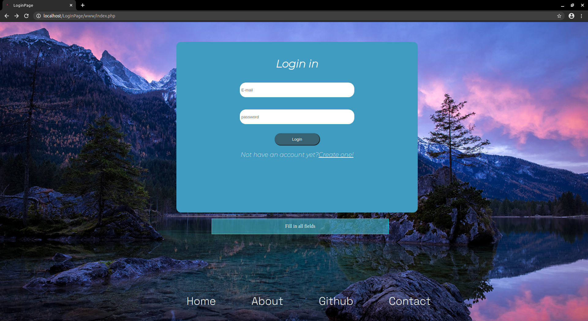
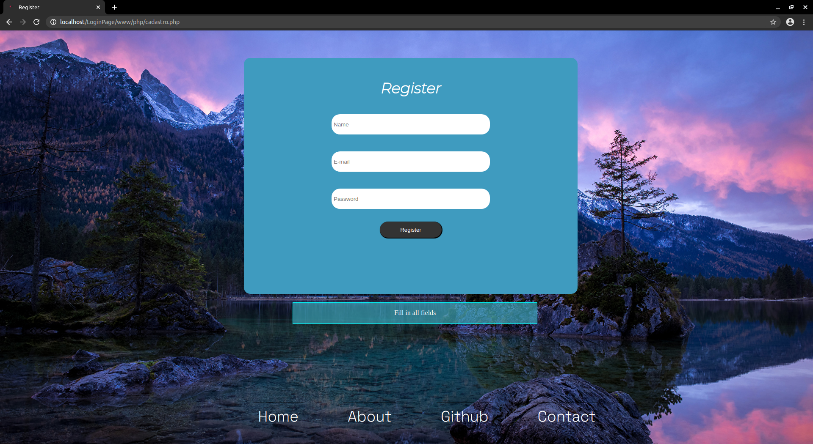
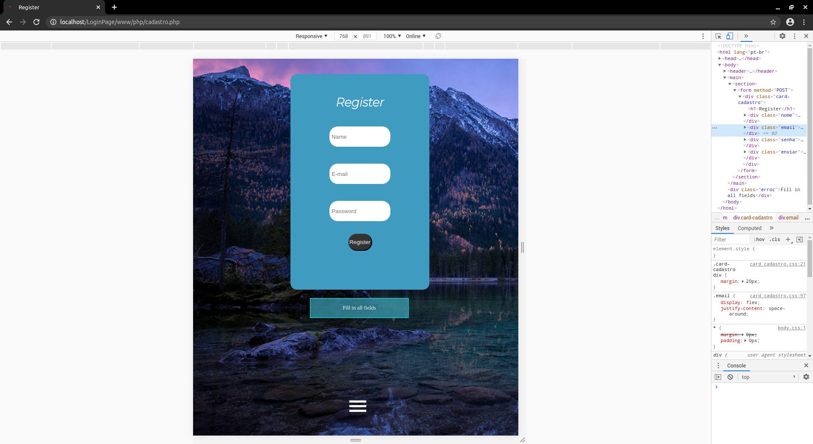
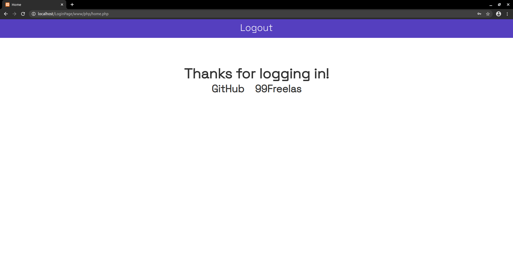

# <h1 align="center">🔒Login Page🔒</h1>
## 
This is a project of a solo login page with registration, protection for sql injection and filter and responsive web design

 # Table of contents
 
   * [About](#about)
   * [Table of contents](#table-of-contents)
   * [Status](#status)
   * [Technology](#technology)
   * [Features](#features)
   * [Dependencies](#dependencies)
   * [How to use](#how-to-use)
   * [Prints](#prints)
   * [Author](#author)
   

   
# About

##### This is a project created as a challenge to myself to test my own skills. It will be a Login page based on the [Layout](../layout/layout.md ) of a login page that I saw on pinterest.

# Status

#### <h4 align="center">finished..🚧🔨💻</h4>

# Technology

  * HTML
  * CSS
  * JAVASCRIPT
  * PHP
  * MYSQL
  
# Features

  - [x] Layout
  - [x] Responsive web design
  - [X] Login system
  - [X] Sql protection
  - [X] Filter
  - [X] Finalization
  
# Dependencies

##### Some Local server (like xampp,lampp etc) to access the sql database

# How to use

#### First copy this repository to your machine
#### Second boot the local server in the repository folder
#### Import one of the .sql files to your sql manager
#### Have fun with your login page!

# <h1 align="center">Prints</h1>

==============================

==============================

==============================

==============================

==============================

  
# <h1 align="center">Author</h1>

##### <h5 align="center">José Wilson Barbosa de Sousa Junior</h5>
